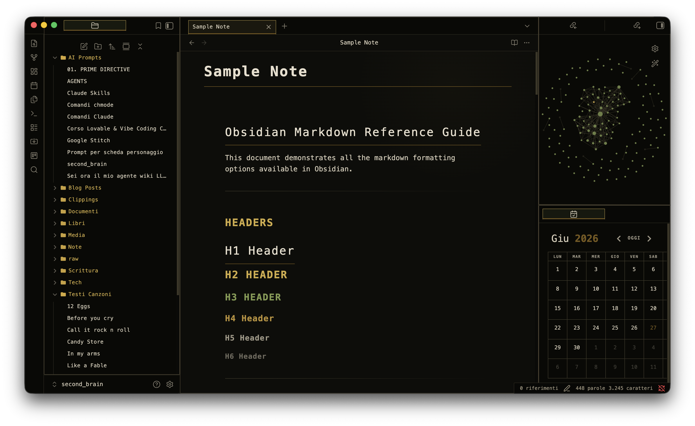

# Cordyceps

> An Obsidian theme inspired by *The Last of Us* — survival logs, tarnished gold, worn borders, and the quiet weight of a world after, with dark and faithful light modes.


---

## Preview



---

## Design

The theme draws from the visual language of *The Last of Us*: blackened charcoal panels, olive-green navigation, tarnished-gold accents, faded paper text, worn borders, and a subtle CRT grain layered over everything. The dark palette keeps the theme weathered and high-contrast, while light mode translates the same mood into aged paper, charcoal text, field olive, rust, and burnt orange. It is built entirely in CSS — no plugins, no external assets, no fonts that need downloading (the theme falls back to system monospace if IBM Plex Mono is absent).

### Color palette

| Token | Hex | Role |
|---|---|---|
| Background | `#090906` | Main canvas |
| Panel | `#0d0d0a` | Sidebars, tabs |
| Text | `#d3cbb7` | Body copy — faded paper |
| Gold | `#d0aa43` | Accents, active tabs, links |
| Olive | `#819a4e` | Navigation, H3 headers, folder icons |
| Orange | `#d87425` | Warm warning accents |
| Rust | `#7a553d` | Subtle warmth |
| Border | `#3b3727` | Worn edges |

---

## Features

- **Pure CSS** — no snippets, plugins, or internet connection required
- **Dark and light modes** — light mode keeps the worn survival-log mood instead of flattening into a neutral theme
- **Subtle CRT scanline** overlay via a single `::before` pseudo-element
- **Panel frames** — each workspace section has a thin gold-olive border around it
- **Infected panel glow** — very subtle olive-amber radial gradients at panel corners
- **File explorer folder icons** — outlined folder shape in gold via CSS mask, no arrows
- **Monospace typography** throughout using IBM Plex Mono (or system fallback)
- **Styled headings**: H1 with a bottom rule, H2 in warm gold uppercase, H3 in olive uppercase, plus distinct H4–H6 accents
- **Blockquote as card** — full four-sided border with dark background
- **Solid HR separators** between content sections
- **Callouts, tables, code blocks** — all reskinned to match the palette
- **Custom checkboxes** with a gold fill and tick on completion
- **Sidebar section labels** (VAULT, TAGS) — 10px uppercase, dim color, spaced apart
- **All view headers** — uppercase label style (GRAPH VIEW, BACKLINKS, etc.)
- **Tag pane** — styled items with gold hover
- **Formatting toolbar** — muted icons, gold on hover
- **Custom scrollbars**, graph view colors, metadata panel, modal and menu styling
- **Mobile-ready** — adjusted padding for small screens

---

## Installation

### Via Obsidian Community Themes *(recommended)*

1. Open **Settings → Appearance → Themes**
2. Click **Manage** and search for `Cordyceps`
3. Click **Install and use**

### Manual

1. Download or clone this repository
2. Copy the `Cordyceps` folder into your vault's themes directory:

```
<your vault>/.obsidian/themes/Cordyceps/manifest.json
<your vault>/.obsidian/themes/Cordyceps/theme.css
```

3. In Obsidian go to **Settings → Appearance → Themes**, refresh the list, and select **Cordyceps**

> **Note:** do not nest the folder — Obsidian requires the `manifest.json` to sit directly inside `.obsidian/themes/Cordyceps/`.

### Optional font

The theme is designed with [**IBM Plex Mono**](https://fonts.google.com/specimen/IBM+Plex+Mono). Install it on your system for the intended look; the theme degrades gracefully to `SFMono-Regular`, `Menlo`, or `Consolas` if it is absent.

---

## Compatibility

- Obsidian **1.5.0** and later
- Dark and light mode

---

## License

MIT © Francesco Palermi
